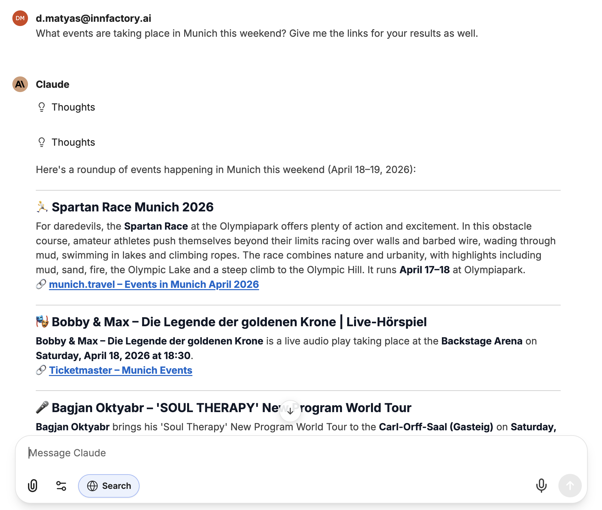
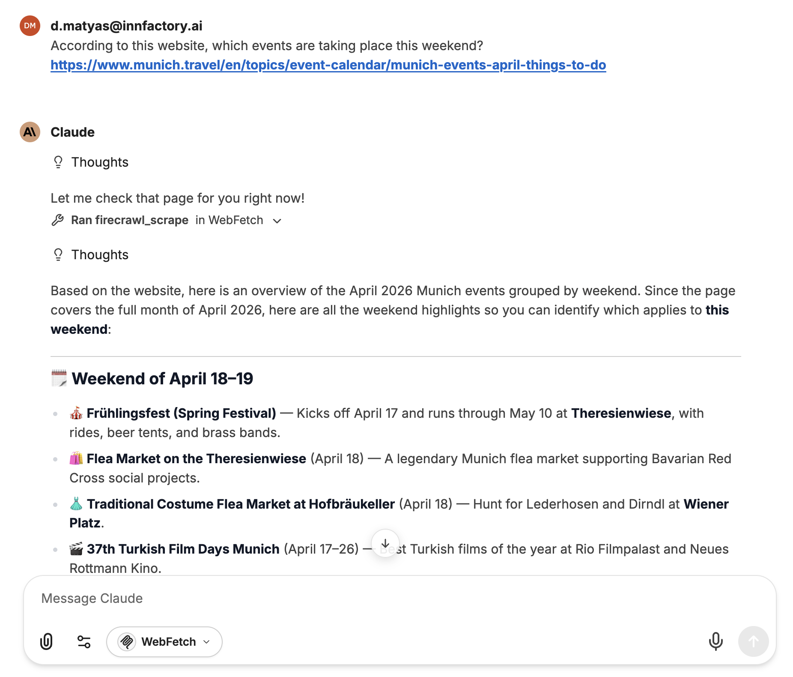

## Web Search

Web Search enables CompanyGPT to search the internet and include current content in its responses. The search must be activated by the user for the current message.

Sources can be included directly in the response on request.

:::tip[Background: Grounding]
Web Search is based on the principle of "grounding" – the AI model bases its responses on current, publicly available information from the web. This reduces hallucinations and improves the accuracy of responses. Learn more on the Google Cloud Blog: [Vertex AI Grounding with Google Search](https://cloud.google.com/blog/products/ai-machine-learning/using-vertex-ai-grounding-with-google-search?hl=en)
:::

## WebFetch

WebFetch is designed for retrieving and processing the content of a specific web page. Unlike Web Search, which independently researches the internet, WebFetch accesses a URL provided by the user and extracts its content.

This is particularly useful when you want to summarize, analyze, or use the content of a known page as the basis for a response.

