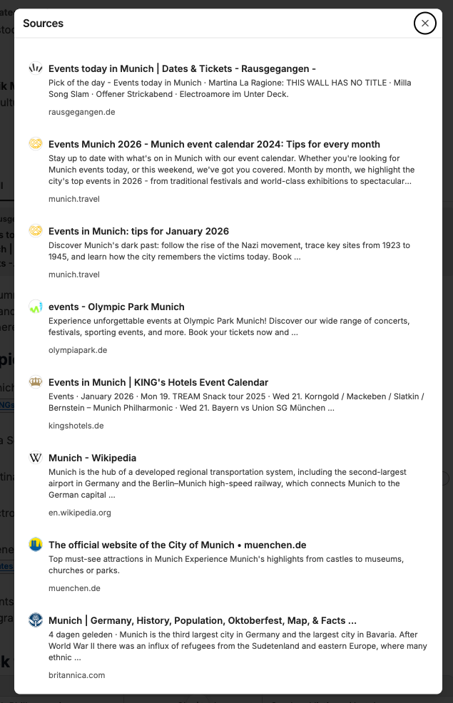

Web search enables CompanyGPT to search the internet and display current content. The websites searched are listed as sources. The search must be activated by the user for the current message.

The sources searched can also be viewed by clicking on **Sources**.

