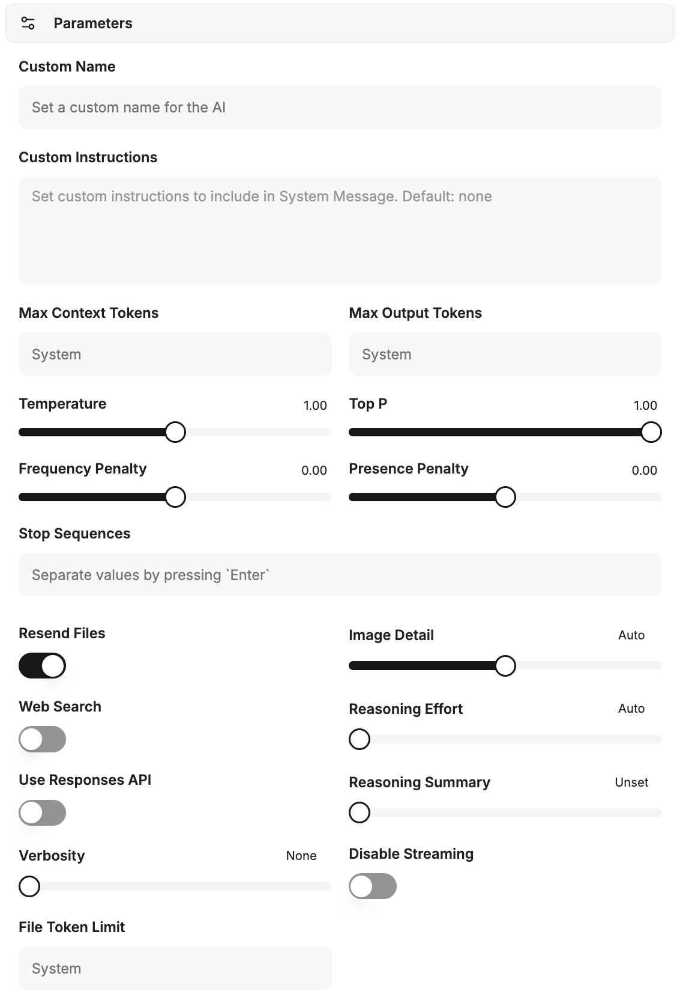

Custom profiles can be created and saved under **Parameters**. These profiles include a name, specific instructions for the AI, and detailed AI parameters. This allows you to define customized presets that can be used flexibly in conversations.



## Custom instructions

This field is used to store specific instructions that control the behavior of the AI during a conversation. It serves to assign the AI a role, style, or specific tasks.

```text
You are a helpful assistant who answers users' questions and makes a joke at the end.
```

## AI parameters

The following parameters allow detailed control of AI behavior and resource usage.

### Maximum context tokens

Defines the maximum number of tokens that can be sent to the model in the context of a request. This parameter controls the amount of data available to the AI for each request. If no value is specified, model-based system defaults are used. Higher values may result in increased costs and potential errors.

### Maximum response tokens

Sets the maximum number of tokens the model is allowed to generate in a chat completion. The total number of input tokens and generated response tokens is limited by the maximum context length of the model. Exceeding the maximum context tokens by this value can lead to errors.

### Temperature

This parameter influences the creativity and randomness of AI responses.
*   **Higher values:** Lead to more creative and random results.
*   **Lower values:** Lead to more deterministic and less creative responses.
It is recommended to adjust either the temperature *or* the top P value, not both at the same time. Values above 1 are generally not recommended.

### Top P

The top P parameter controls the model's selection of tokens based on their cumulative probability. The model selects tokens from the most probable downward until the sum of their probabilities reaches the specified Top P value. This influences the diversity of possible response tokens.

### Frequency Penalty

A value between -2.0 and 2.0. Positive values reduce the likelihood that the model will repeat tokens that have already been used frequently. This encourages the generation of new and more diverse formulations in the text.

### Presence Penalty

A value between -2.0 and 2.0. Positive values penalize the use of tokens that already appear in the text so far. This increases the model's tendency to address new topics or diversify information.

### Stop Sequences

Up to four definable character strings that, when encountered, cause the API to stop generating further tokens. This allows precise control of the AI's response endings.

### Resend Attachments

If this option is enabled, all files previously attached to the chat are resent to the model with each new message.
**Note:** This can significantly increase the cost of a request due to the increased number of tokens and lead to errors with many attachments.

### Image detail

Determines the resolution for image recognition requests to the model:
*   **Low:** Cheaper and faster, but offers less detail.
*   **High:** More detailed and accurate, but more expensive.
*   **Auto:** Automatically selects between “Low” and “High” based on the resolution of the uploaded image.

### Web Search

Enables the model's integrated web search function (e.g., via OpenAI). This allows the AI to obtain current information from the internet and thus generate more accurate and up-to-date responses.

### Reasoning effort

Applies only to models that perform internal reasoning. This parameter limits the computational effort required for logical conclusions.
*   Reducing the reasoning effort results in faster responses and lower token consumption.
* The “Minimal” setting generates very few reasoning tokens to achieve maximum response speed (time-to-first-token). This is particularly useful for tasks such as coding or strictly following instructions.

Use Responses API

Enables the use of the Responses API (instead of Chat Completions), which provides advanced features from OpenAI. This API is required for using models such as o1-pro and o3-pro, as well as for enabling summaries of the reasoning process.

### Summary of the thought process

Only available when using the Responses API. This option generates a summary of the model's internal thought process. This can be helpful for troubleshooting and better understanding AI decisions. Selectable options are: “none,” “automatic,” “short,” or “detailed.”

### Verbosity

Controls the length and depth of detail of the model's responses.
*   **Lower values:** Result in shorter, more concise responses.
*   **Higher values:** Result in more verbose and detailed responses.
Currently, the levels “low,” “medium,” and “high” are supported.

### Disable streaming

Disables line-by-line streaming of responses so that the model's complete response is received at once. This option may be useful for certain models (e.g., o3) that require organizational verification for streaming.

### File token limit

Defines a maximum token limit for processing attached files. This is used for cost control and efficient resource management during file analysis by the AI.