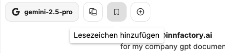

Bookmarks can be added to conversations to find them more quickly. This also allows chats on specific topics to be grouped together.

These can be given a `title` and `description`.

The bookmark button above the conversation history allows you to view all saved conversations related to the bookmarks.