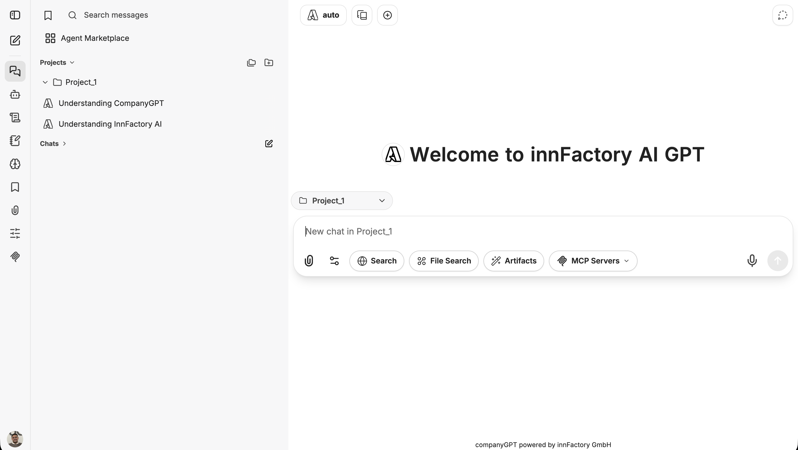
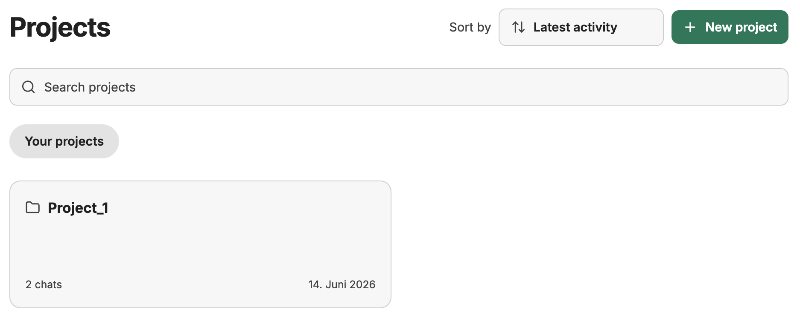
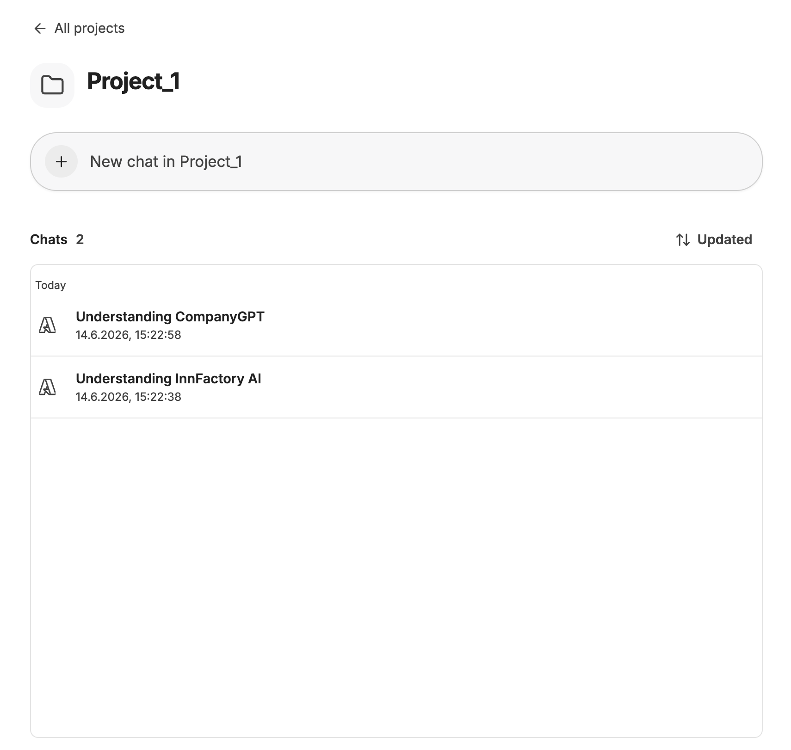

Projects make it possible to group chats by topic and manage them in a structured way. This helps you maintain an overview even as the number of conversations grows.

## Projects in the Sidebar

Projects are managed in the left sidebar under the **Projects** section. Click on a project to expand or collapse it and view the chats it contains. The **All Projects** button takes you to the project overview. Use **Create new project** to create a new project directly.

## Create a Project

Click **Create new project** in the sidebar to create a new project. A dialog window opens where you can enter a **Project name**. Confirm with **Create project** or cancel the action with **Cancel**.

## All Projects

The overview page lists all your projects as cards. Each card shows the project name, the number of chats it contains, and the date of the last activity. You can use the **Search projects** field to search for a specific project. The **Sort by** dropdown lets you sort projects by **Latest activity**, **Created at**, or **Name**. Use **+ New project** to create another project.

## Project Overview

Click on a project to open the detail view. Use the **+ New chat in Project** button to start a new chat directly within the project. Chats can be sorted by last interaction or creation date.

## Assigning a Chat to a Project

New chats can be created directly within a project. If you start a chat via the sidebar of a project or via the project overview, it is automatically assigned to that project.

## Chat Options in the Sidebar

For each chat within a project in the sidebar, a **⋯** menu appears on hover. The following options are available:

- **Move to another project** – assigns the chat to a different existing project
- **Remove from project** – removes the link between the chat and the project without deleting the chat
