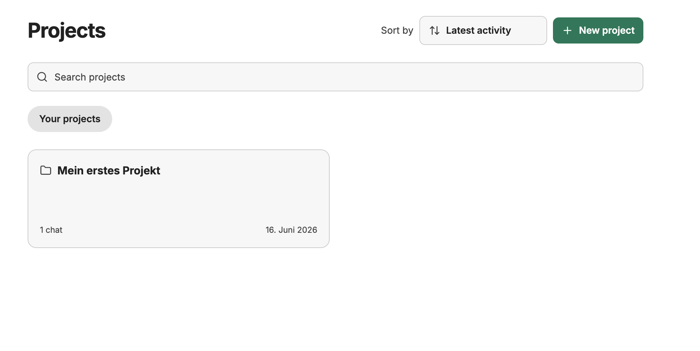
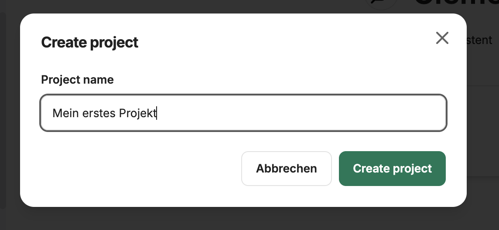
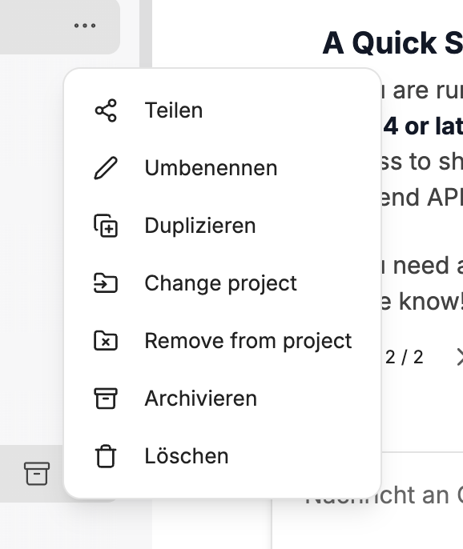

Projects let you organize related conversations into named workspaces. They are useful for long-running workstreams, teams, clients, or any topic where you want a focused set of chats without relying on search alone.

## What Projects Do

- Group conversations under a project
- Start a new chat directly inside a project
- Assign an existing conversation to a project or remove it again
- Browse project chats from the project workspace
- Search and sort the project list
- Rename or delete projects from the sidebar

Projects are personal and only visible to the person who creates them. Other users do not see your project list.

## Create a Project

Open **Projects** in the sidebar and choose **New project**. Give the project a name, then CompanyGPT opens the project workspace.

From within a project workspace, use **New chat in project** to start a conversation that is automatically assigned to that project.

## Assign Existing Chats

Open a conversation's menu and choose the project option. Select a project to assign the chat, or choose **Unassigned** to remove it from a project.

When you open a project, CompanyGPT shows only the chats assigned to that project. You can still display the full conversation list through **All projects**.

## Manage Projects

Each project appears in the sidebar. Use the project menu to:

- Open the project workspace
- Rename the project
- Delete the project

Deleting a project only removes the project assignment from its chats. The conversations themselves are not deleted.

## Notes

- Project workspaces have their own chat list and sorting controls.
- Chats started from within a project keep that project assignment.
- If a project is deleted while you are viewing it, CompanyGPT returns you to the projects list.
