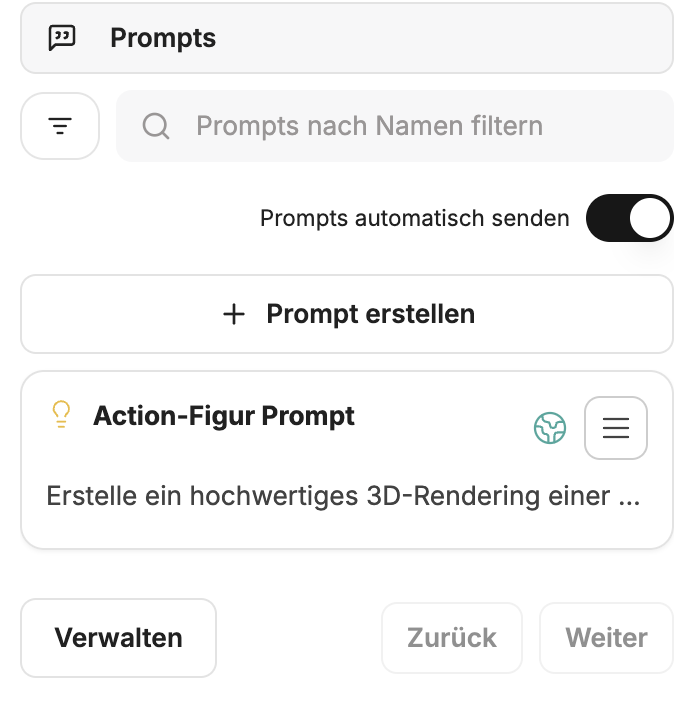
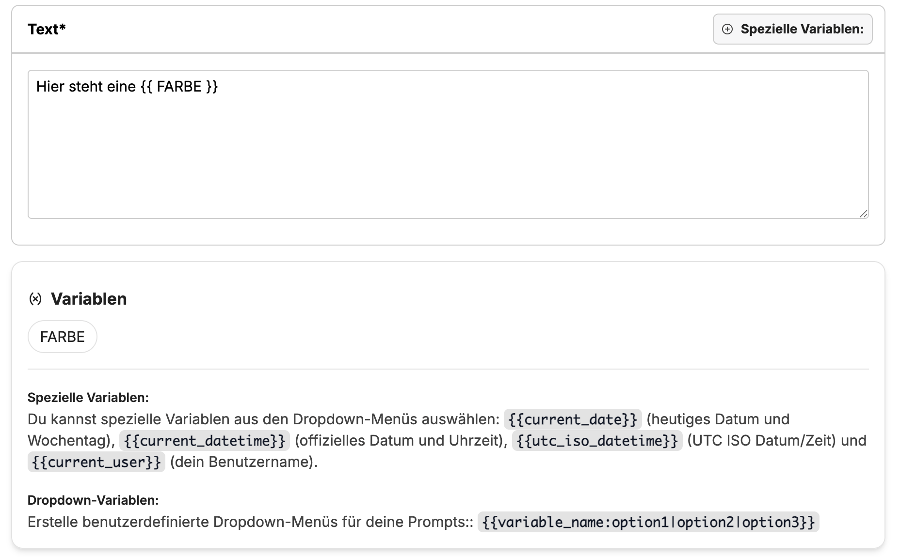
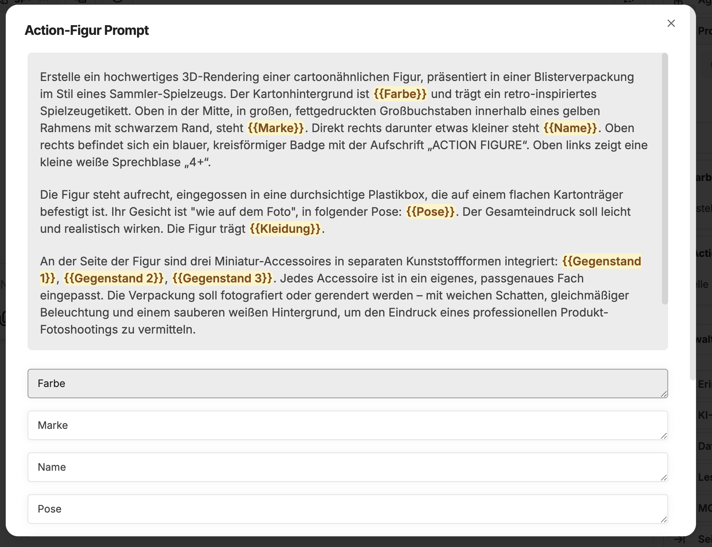
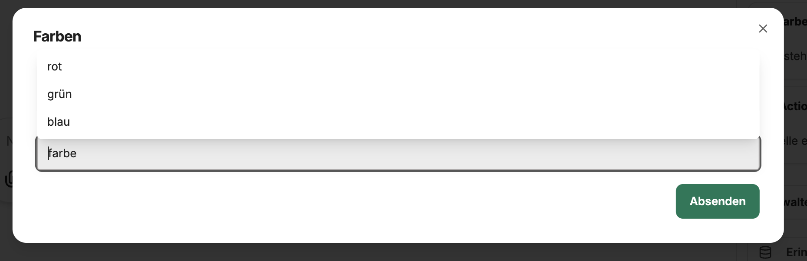

Prompts in CompanyGPT are prompt templates that can be saved and used at any time. The templates are independent of the AI model or agent and can also be used with any available model or agent.

Prompt templates can be viewed, created, modified, or used in the right sidebar under **Prompts**.



## Components of prompt templates

- **Prompt name**: The name of the prompt, which is also displayed in the quick selection.
- **Category**: The category to which the prompt is assigned, for example **Ideas**, **Learning**, **Writing**.
- **Text**: The actual content of the prompt.
- **Variables**: Variables within the text that can be filled with appropriate content for execution.

### Variables

- **Special variables**: These are predefined and do not need to be set manually, but are filled automatically. These are **date**, **time**, **user**.
- **Custom variables**: Custom variables can be set within the text. These are marked with double curly brackets, e.g., `{{ COLOR }}` => creates the variable `COLOR`



As soon as the prompt is executed, an input window for the variables opens.



Dropdowns can also be selected as a selection menu for the variables. The following syntax is required for this:

```
{{variable_name:option1|option2|option3}}

# Example
{{ color:red|green|blue}}
```


Prompt templates can be used very effectively for recurring tasks, for [prompt chaining](/prompt-engineering/prompt-techniques/prompt-chaining), or in conjunction with [agents](/company-gpt/agents/).