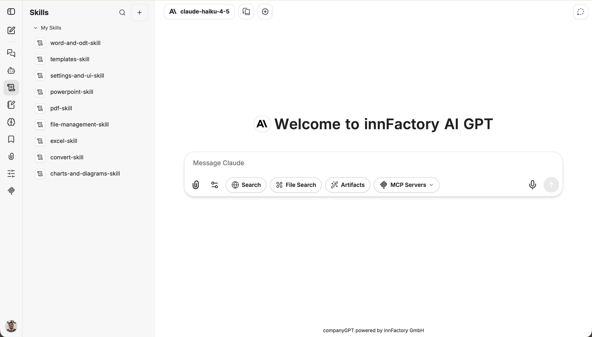
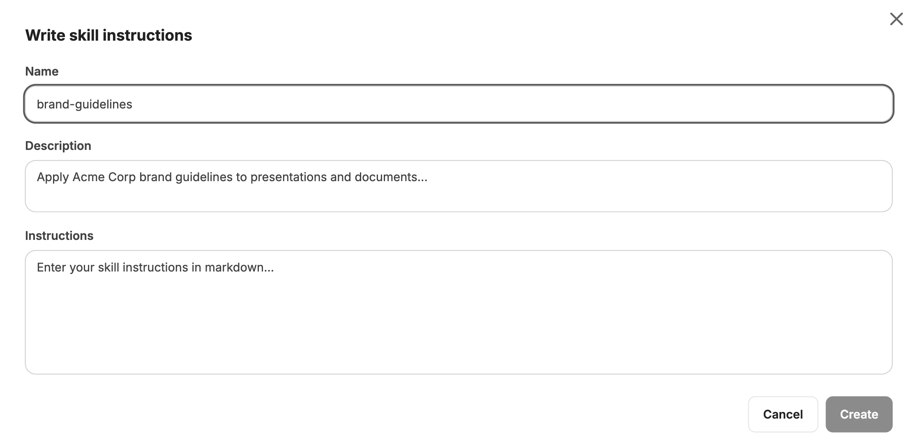
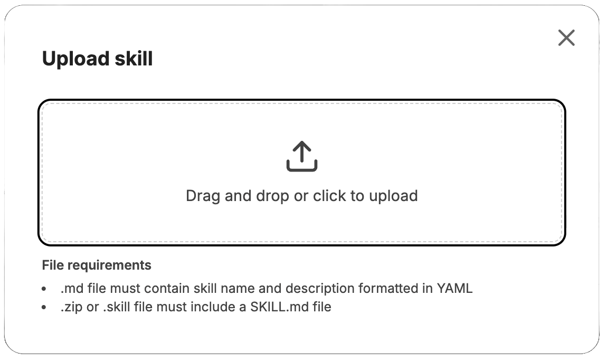
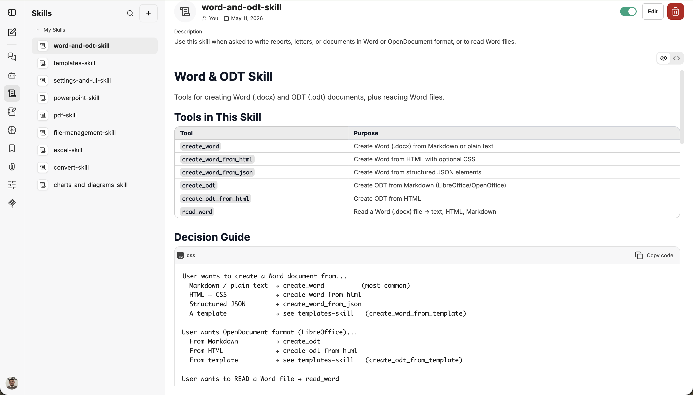
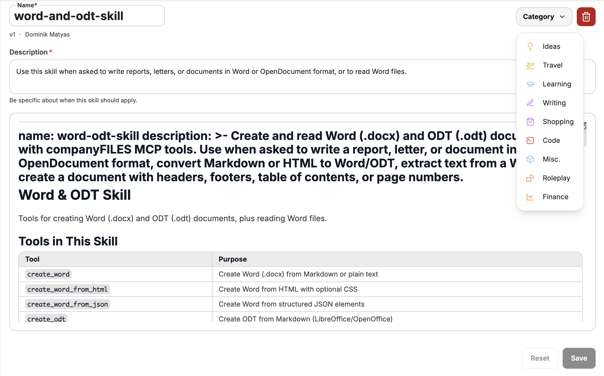
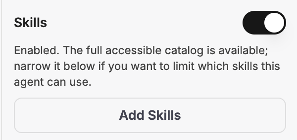
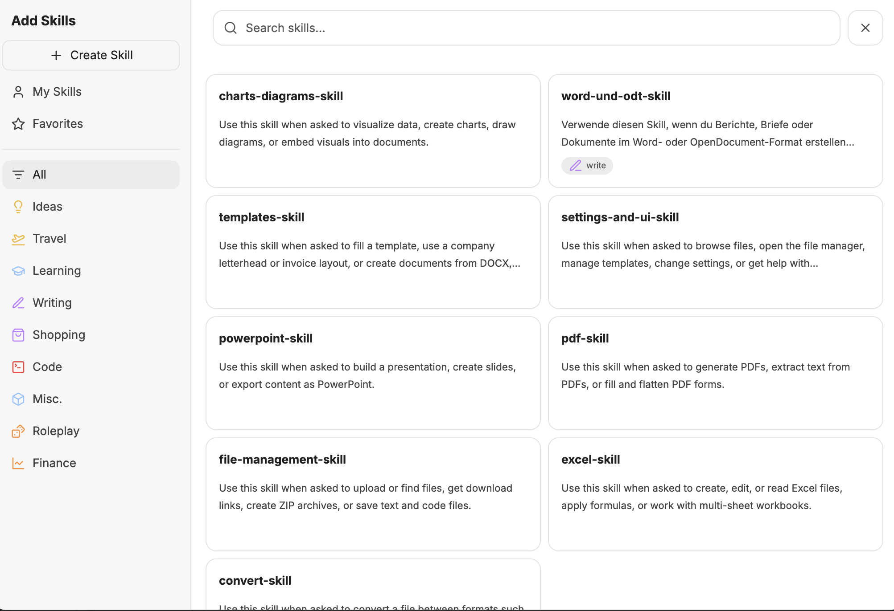

Skills are reusable instructions that specialize the AI assistant for specific tasks. They extend the assistant’s capabilities without requiring you to rewrite complex prompts every time.

## Skills overview

Skills are managed in the left sidebar under **Skills**. Under **My Skills**, you can see all your skills at a glance.

## Creating a skill

Click the **+** button at the top of the Skills sidebar to create a new skill. A dropdown menu appears with two options.

### Write skill instructions

Select **Write skill instructions** to create a skill yourself. You need to fill in the following fields:

- **Name** – A unique name for the skill
- **Description** – A short explanation of when and what the skill is used for
- **Instructions** – The actual instructions in Markdown format

### Upload a skill

Select **Upload a skill** to upload an existing skill file via drag & drop or click.

The following file formats are supported:

| Format            | Requirements                                      |
| ----------------- | ------------------------------------------------- |
| `.md`             | Must contain skill name and description in YAML   |
| `.zip` / `.skill` | Must include a `SKILL.md` file                    |

:::tip
You can find ready-made skills to try and download in [Skills Tutorials](/en/tutorials/skills/).
:::

## Skill view

The detail view of a skill shows the rendered content with description and Markdown content, for example tool tables or decision guides.

From here, you can:

- **Enable or disable** – using the toggle in the top-right corner
- **Edit** – adjust instructions, name, or category
- **Delete** – remove the skill permanently

## Editing a skill

Open a skill and click **Edit** to adjust name, description, instructions, and category.

:::note
The **Description** determines when the skill is activated automatically. Write it so the assistant can recognize the correct use case.
:::

## Adding skills to agents

Skills can also be assigned directly to an [agent](/en/company-gpt/agents/). Open the agent settings and enable the **Skills** toggle. By default, the agent has access to the full skill catalog.

Click **Add Skills** to select specific skills that the agent is allowed to use. This lets you precisely control an agent's capabilities.

