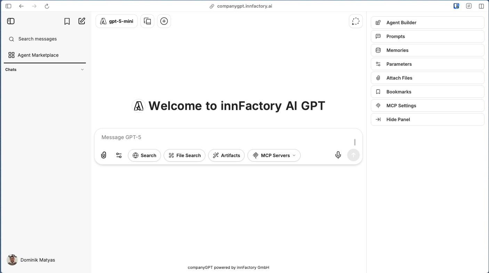
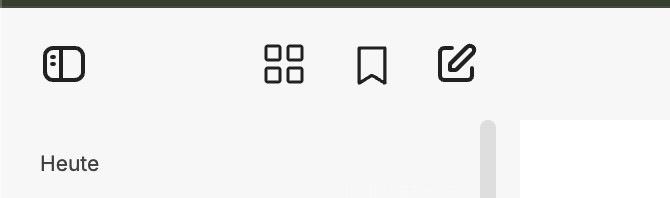
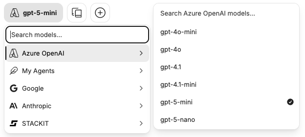
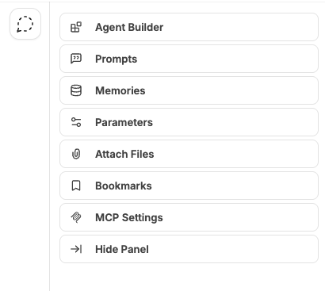

The CompanyGPT user interface allows you to communicate with different AI models, create agents, manage prompt templates, and much more. 

## Quick Selection 

- Hide sidebar
- [Agent Marketplace](/company-gpt/agents/#agent-marketplace)
- [Bookmarks](/company-gpt/bookmarks)
- New chat

## Model selection

## Right sidebar

- [Create and edit agents](/company-gpt/agents/)
- [Prompt templates](/company-gpt/prompts/)
- [Reminders](/company-gpt/reminders/)
- [AI settings](/company-gpt/ai-settings/)
- [Files](/company-gpt/file-processing/)
- [Bookmarks](/company-gpt/bookmarks)
- Hide sidebar

## Chat input

- Prompt input
- [Files](/company-gpt/file-processing/)
- Extension settings
- [Web search](/company-gpt/integrations/web-search/)
- [File search](/company-gpt/integrations/file-search/)
- [Artifacts](/company-gpt/integrations/artifacts/)
- Select [MCP Server](/company-gpt/integrations/mcp-server/)