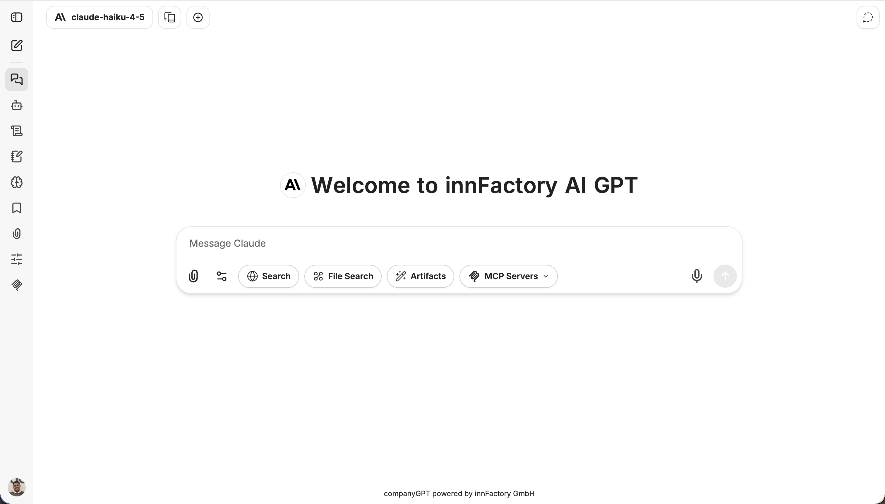
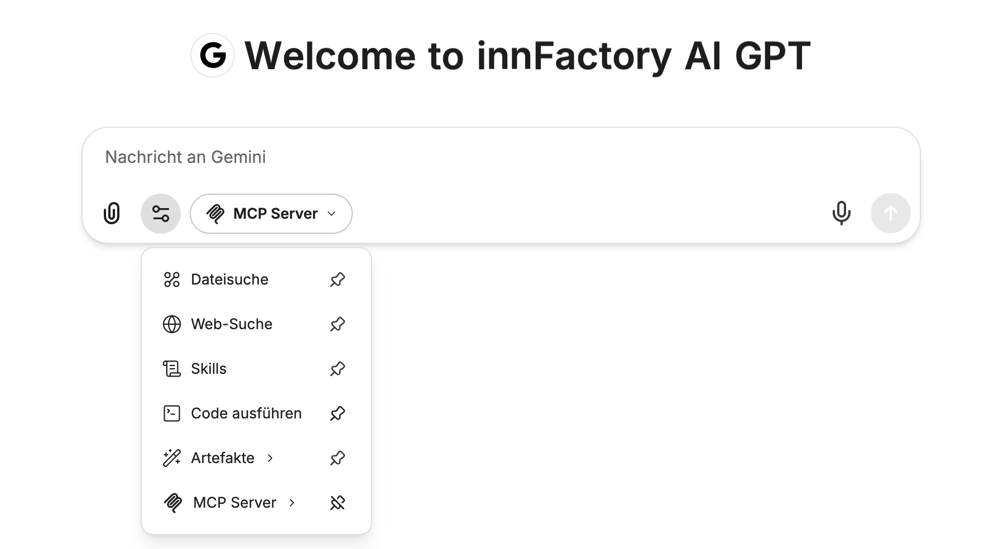

import sidebarImg from "./ui-sidebar.png";
import chatVerlaufImg from "./chat-verlauf.png";

The User Interface in CompanyGPT allows you to communicate with different AI models, create agents, manage prompt templates, and much more.

## Model Selection

A list of currently available models can be found under [Model Selection](/en/company-gpt/modellauswahl).

## Chat Input

Prompts can be entered via keyboard or microphone.

 
 
**[Add Files](/en/company-gpt/dateiverarbeitung/):**

 
**Integration Settings:** 

- [File Search](/en/company-gpt/integrationen/dateisuche/)
- [Web Search](/en/company-gpt/integrationen/websuche/)
- [Skills](/en/company-gpt/skills)
- [Run Code](/en/company-gpt/code-interpreter/)
- [Artifacts](/en/company-gpt/integrationen/artefakte/)
- [MCP Server](/en/company-gpt/integrationen/mcp-server/)

By selecting the pin icon, you can pin the integrations permanently to the chat bar.

## Chat History

The chat history displays all chats that have been created in the past. Chats can be shared, renamed, duplicated, archived, and deleted. Additionally, the entire chat history can be searched using the search function.

## Sidebar

  
  

1. **Open/Hide Sidebar**
2. **New Chat**
3. **[Chat History](/en/company-gpt/user-interface/#chat-history)**
4. **Apps**
5. **[Create Agents](/en/company-gpt/agenten/)**
6. **[Skills](/en/company-gpt/skills)**
7. **[Prompts](/en/company-gpt/prompts/)**
8. **[Memories](/en/company-gpt/erinnerungen/)**
9. **[Bookmarks](/en/company-gpt/lesezeichen)**
10. **[Attach Files](/en/company-gpt/dateiverarbeitung/)**
11. **[AI Settings](/en/company-gpt/ki-einstellungen/)**
12. **[MCP Settings](/en/company-gpt/integrationen/mcp-server/)**

  

## Keyboard Shortcuts

The list of all available keyboard shortcuts can be opened either by pressing the ? key (when the cursor is not in a text field) or via the user menu at the bottom left under "Keyboard shortcuts".

