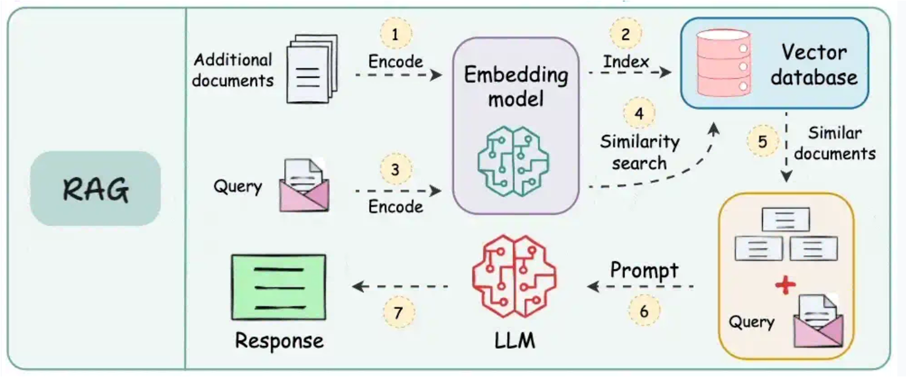

## Understanding RAG: Retrieval Augmented Generation

In the world of large language models (LLMs), **RAG (Retrieval Augmented Generation)** is a powerful technique designed to improve the capabilities and accuracy of generative AI. Essentially, RAG enables the AI models in CompanyGPT to access and utilize current, specific, and often proprietary information from external and internal sources beyond their original training knowledge. 

### What is RAG?

At its core, RAG is a method that combines an information retrieval system with a generative LLM. Instead of relying solely on the LLM's internal knowledge (which may be outdated or lack domain-specific details), RAG first retrieves relevant information from a specific knowledge base and then supplements the LLM's prompt with this retrieved context. The LLM then uses this enriched context to *generate* a more informed, accurate, and substantiated response.

You can think of RAG as providing the LLM with an “open book” that it can consult before responding, rather than relying solely on its memory.

### RAG as a specialized tool

As explained above, RAG can be viewed as a specialized type of “tool” within a broader [tool use framework](./tool-use.md). While general tools can perform actions (such as sending an email or updating a database) or retrieve real-time data, RAG's primary function is to **gather information for contextual text generation**. It is specifically designed to:

*   **Basing answers on facts.** To prevent the LLM from “hallucinating” or generating incorrect information.
*   **Accessing proprietary knowledge.** CompanyGPT can answer questions based on your internal documents, policies, or data.
*   **Provide up-to-date information.** To ensure that responses reflect the latest information in your knowledge base, even if it was not part of the LLM's original training data.
*   **Expand context.** To provide the LLM with rich, relevant details for more comprehensive and helpful responses.

### Why use RAG with CompanyGPT?

Integrating RAG capabilities into CompanyGPT offers significant advantages:

*   **Accuracy & reliability:** Answers are directly supported by verifiable external data.
*   **Domain specificity:** CompanyGPT can become an expert on your company's specific operations, products, and internal documents.
*   **Up-to-date information:** No longer limited by training data cut-off dates, CompanyGPT can answer questions based on the latest internal reports, meeting notes, or policy updates.
*   **Reduction of hallucinations:** By providing explicit context, the likelihood of the LLM confidently generating incorrect information is drastically reduced.
*   **Improved user experience:** Users receive more relevant, accurate, and trustworthy answers.

## RAG workflow for file processing

The process of how CompanyGPT uses RAG for file processing, e.g., when searching through your uploaded documents, follows a clear and efficient workflow. This enables the system to intelligently find and use the most relevant parts of your internal knowledge base.

(Source: [https://blog.dailydoseofds.com/p/9-rag-llm-and-ai-agent-cheat-sheets](https://blog.dailydoseofds.com/p/9-rag-llm-and-ai-agent-cheat-sheets))

Here is a breakdown of the typical RAG workflow for document retrieval:

1.  **Upload documents and encode them using an embedding model:**
    When you upload documents (e.g., PDFs, Word files, internal reports), they are first processed. This involves breaking them down into smaller, manageable sections (e.g., paragraphs or sections). Each section is then converted into a numerical representation, known as an “embedding,” using a specialized AI model (an embedding model). These embeddings capture the semantic meaning of the text.

2.  **Index embeddings in vector database:**
    The generated embeddings of all your document sections are stored in a highly efficient database, known as a vector database. This database is optimized for storing and quickly searching these numerical vectors based on their similarity.

3.  **Encode search query with the same embedding model:**
    When a user sends a query to CompanyGPT (e.g., “What is our telework policy?”), that query is also converted into an embedding using the *exact same* embedding model that was used for your documents. This ensures consistency in the representation of semantic meaning.
    
4.  **Perform similarity search between encoded data in the vector database:**
    The encoded user query (its embedding) is then compared with all stored embeddings of the document sections in the vector database. The system performs a “similarity search” to find the document sections whose embeddings are numerically closest to the embeddings of the query. This indicates semantic relevance.

5.  **Use similar documents and expand the original query:**
    The most relevant document sections (often referred to as “context” or “retrieved passages”) are then extracted. These retrieved sections, which contain the factual information relevant to the user's question, are then combined with the original user query.

6.  **Prompt LLM with documents, query, and system instructions:**
    Finally, this expanded prompt—which includes the original query, the retrieved relevant document sections, and any internal system instructions (e.g., “Respond concisely,” “Refer to the documents provided”)—is sent to the large language model within CompanyGPT.

7.  **Return response to user:**
    The LLM processes this comprehensive prompt and draws directly on the provided document context to formulate an accurate, informed, and helpful response, which is then returned to the user.

This seamless process ensures that CompanyGPT delivers responses that are not only conversational but also factually sound and directly relevant to your company's unique information landscape.