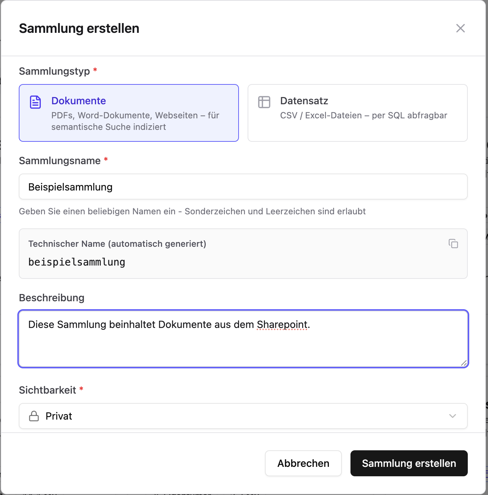
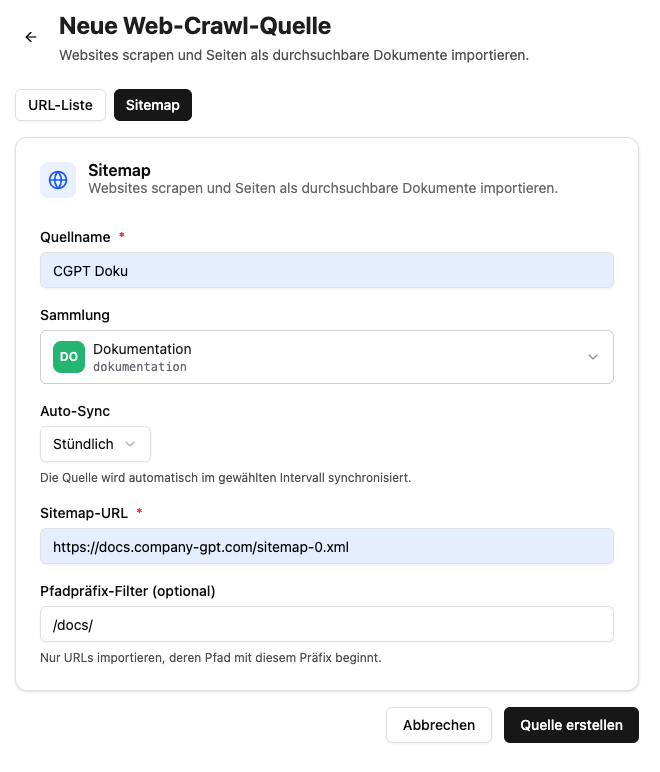
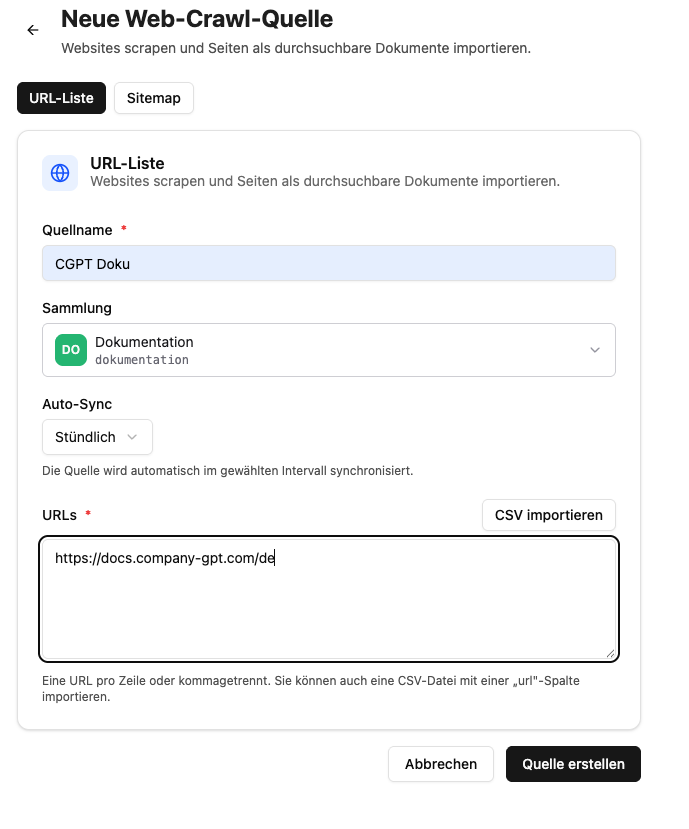
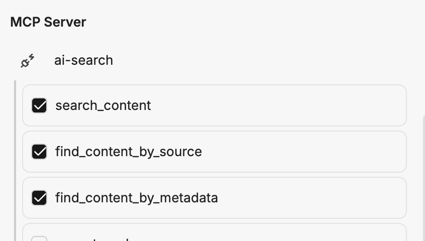

import CollectionPromptBuilderEN from '../../../../../components/CollectionPromptBuilderEN.astro'

In this guide we set up a **help agent** that answers questions about a documentation website. To do this, we let the [web crawl source](/en/company-gpt/addons/companyrag/quellen/#web-crawl) of [CompanyRAG](/en/company-gpt/addons/companyrag/) crawl the website's sitemap on a regular schedule, index all pages in a collection, and then make it available to an [agent](/en/company-gpt/agenten/) via the `ai-search` MCP Server.

As an example we use the public CompanyGPT documentation with the sitemap `https://docs.company-gpt.com/sitemap-0.xml`. Replace it with the sitemap of your own website.

Prerequisite: You have access to CompanyRAG at `https://COMPANY.company-gpt.com/companygpt/rag` (with a custom domain, just append `/companygpt/rag`) and the right to create agents.

## 1. Create a Collection

First we create the collection in which the crawled pages will be indexed. In CompanyRAG, navigate to `Collections` and create a new collection. Select **Documents** as the type, enter a name and a description, and choose the visibility.

Note the **technical name** (`dokumentation` in the example) – it will be needed later in the agent prompt.

For visibility, you can choose between **Private** and **Public**. A help agent that should be available to all employees usually benefits from a **public** collection. Visibility can be changed at any time.

### Advanced Settings

In the advanced settings you can adjust the search language, chunking strategy, chunk size, and overlap. The default values can be left as-is to get started.

:::tip
The search language should ideally match the language of the website. In addition to semantic search, a full-text search is performed that yields better results with the correct language setting.
:::

## 2. Create a Web Crawl Source

To index the pages automatically and recurrently, we create a web crawl source. Switch to the **Sources** section.

Click **"+ Web-Crawl"** to create a new source. In the dialog, select the **Sitemap** tab and fill in the fields:

- **Source name**: A freely chosen name for recognition, e.g. `CGPT Doku`.
- **Collection**: The collection created in step 1 (`dokumentation`).
- **Auto-Sync**: The interval at which the sitemap is crawled again, e.g. **Hourly**, **Daily**, or **Weekly**. The source is then synchronized automatically at the chosen interval.
- **Sitemap URL**: `https://docs.company-gpt.com/sitemap-0.xml`
- **Path prefix filter (optional)**: Restricts which pages are indexed. `/docs/`, for example, would only import URLs whose path begins with `/docs/`. Leave empty to crawl the entire sitemap.

Confirm with **Create source**.

:::note
On sitemap crawls, the entire sitemap is indexed on the first run. On every subsequent run, only the **difference** based on the last crawl and the pages' modification date is considered – so only new or changed pages are re-indexed.
:::

:::tip
Instead of a sitemap, you can also crawl individual pages or a CSV-imported list of URLs via the **URL list** tab. For individual pages, the entire page is always re-indexed on every run.

:::

## 3. Start the Crawl and Check the Status

After creation, the source appears as active under **All sources**. If needed, trigger the first crawl manually via **Sync now**. The discovered pages are then queued as indexing jobs.

You can track progress in the **Jobs** section. There you see the status per page (Pending, Running, Completed, or Failed). Once all jobs are **Completed**, the collection is searchable.

:::note[Add screenshot]
A screenshot of the **Jobs** section showing the running or completed indexing jobs of the web crawl source fits here. *(Placeholder – please add `auftraege-status.png` to this folder and embed it.)*
:::

Via the **source actions** you can **Pause/Resume** or **Delete** the source at any time. When deleting, already indexed pages remain in the collection.

## 4. Create the Help Agent

So that the indexed pages can be queried through the chat, we create an [agent](/en/company-gpt/agenten/). It requires the [MCP Server](/en/company-gpt/integrationen/mcp-server/) `ai-search` with the tools `search_content`, `find_content_by_metadata`, and `find_content_by_source` enabled.

A smaller AI model is usually sufficient, e.g. **Claude Haiku** or **Gemini Flash** – but any available model works.

### System Instruction

For the system instruction, you can use our template below. It includes all the necessary instructions so that answers are consistently structured, always run a search, and are based only on the indexed content (no hallucination).

:::tip
Pass the full prompt to an LLM and have it adapted to your needs – e.g. with your company name or a specific answering style.
:::

Enter the **technical name** of your collection (`dokumentation` in the example) – the prompts will be filled in automatically:

<CollectionPromptBuilderEN />

## 5. Use the Agent

Save the agent. Then select it in the chat via the model selection and ask a question about the documentation. The agent runs a search in the collection and answers with the content it finds, including source references.

Because the web crawl source automatically re-crawls at the chosen interval, the agent always stays up to date with the website without any further action.
