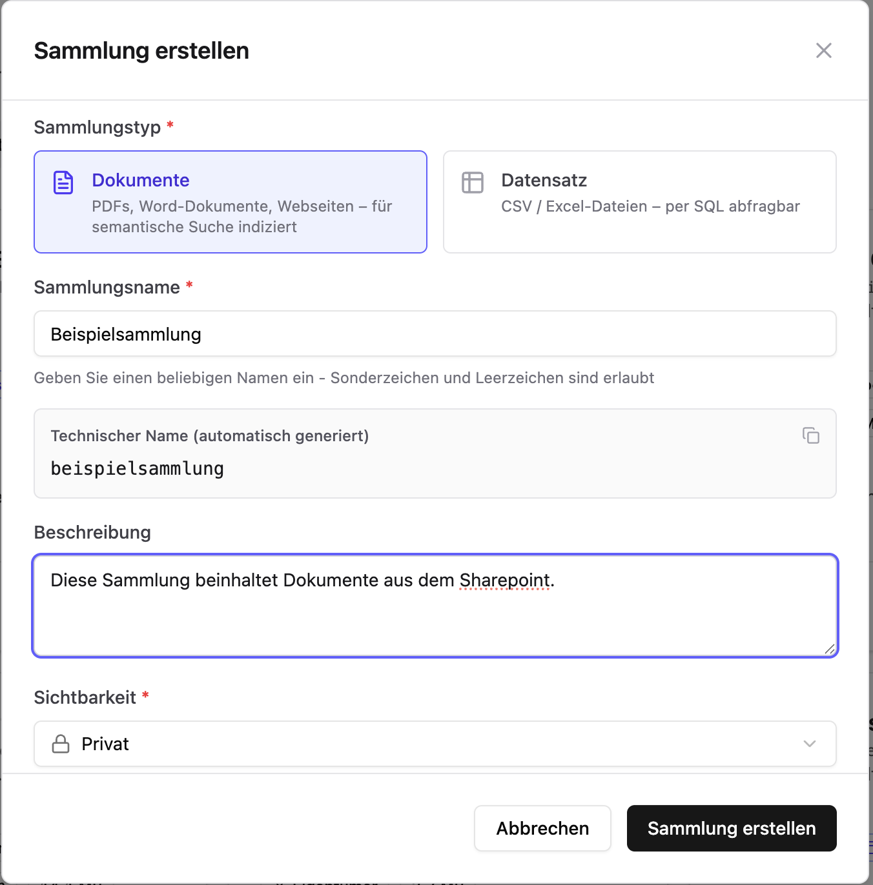
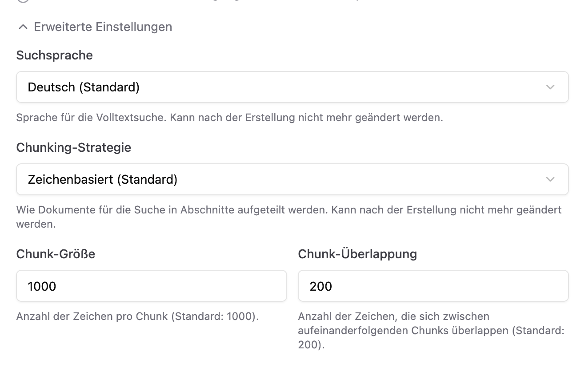
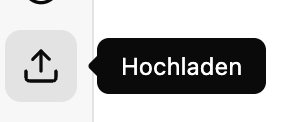
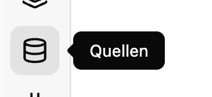
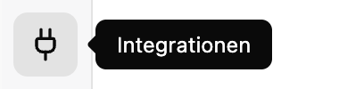
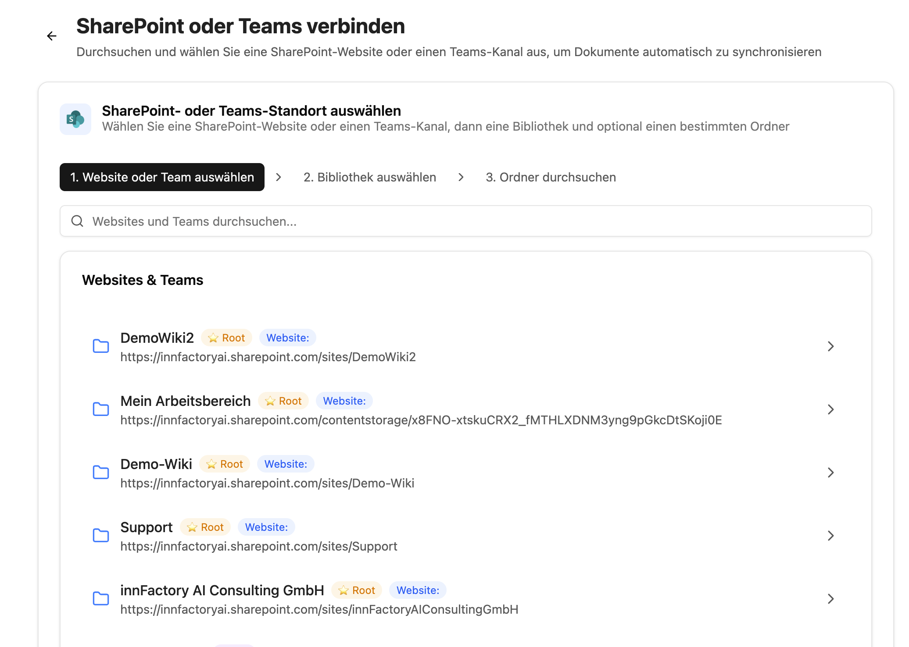
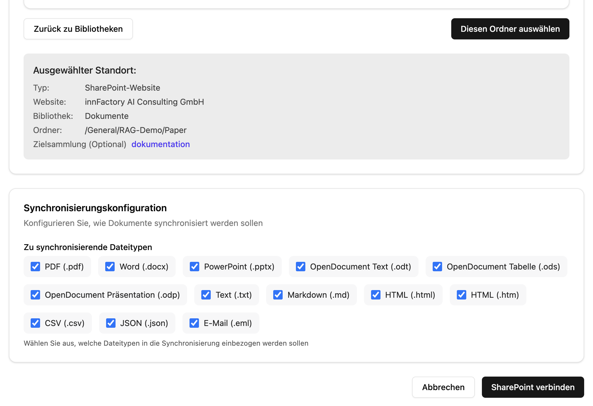

import CollectionPromptBuilderEN from '../../../../../components/CollectionPromptBuilderEN.astro'

To use CompanyRAG in CompanyGPT, we first need to create a document collection. Navigate to `https://COMPANY.company-gpt.com/companygpt/rag` (if you use a custom domain, just append `/companygpt/rag`).

## Create a Collection

Navigate to `Collections` and create a new collection. Select **Documents** as the type, enter a name, a description, and choose the visibility.

The **technical name** will be relevant for the prompt later.

.

For visibility, you can choose between **Private** and **Public**. **Public** collections are available to all users; **private** collections are only accessible to the owner, but can be shared with others at any time. Visibility can be changed at any point.

### Advanced Settings

In the advanced settings you can adjust the search language, chunking strategy, chunk size, and overlap. The default values can be left as-is for most use cases.

:::tip
The search language should ideally match the language of the documents in the collection. Both semantic and full-text search are performed, and full-text search works better with the correct language setting.
:::

## Index Documents

Once the collection is created, you can add documents.

### Manual Upload

Simply select the collection and the documents and upload them. Manual uploads have no file-level permissions and no additional metadata beyond the file name.

### SharePoint / NextCloud Sync

Under Sources, a new connection can be created.

:::tip
If no source has been connected yet, the SharePoint connection must be activated under **Integrations**.

:::

A new SharePoint connection can then be created under Sources. Select the SharePoint folder you want to use — all subfolders of the selected folder are always included.

Once the desired folder is selected, choose the collection and click **Select This Folder**.

Then select the file types to index and click **Connect SharePoint**.

:::note
Documents indexed via SharePoint have document-level permissions. When querying through CompanyGPT, permissions are always checked regardless of how the collection is shared.
:::

## CompanyGPT Agent

Via the [MCP Server](/en/company-gpt/integrationen/mcp-server/) `ai-search`, the RAG service can be connected to CompanyGPT to search indexed documents across all collections available to the user
(see [Similarity Search](/en/prompt-engineering/prompt-techniken/rag/)).

### Agent Prompt

To use the RAG search, an [agent](/en/company-gpt/agenten/) must be created. It requires the MCP Server `ai-search` with the tools `search_content`, `find_content_by_metadata`, and `find_content_by_source` enabled.

A smaller AI model is usually sufficient for the agent, e.g. **Claude Haiku** or **Gemini Flash**, but any other model works too.

For the system instruction, you can use our template below. It includes all necessary instructions to produce consistently structured answers.

:::tip
You can pass the full prompt to an LLM and have it adapted to your specific needs.
:::

Enter the **technical name** of your collection — the prompts will be filled in automatically:

<CollectionPromptBuilderEN />
