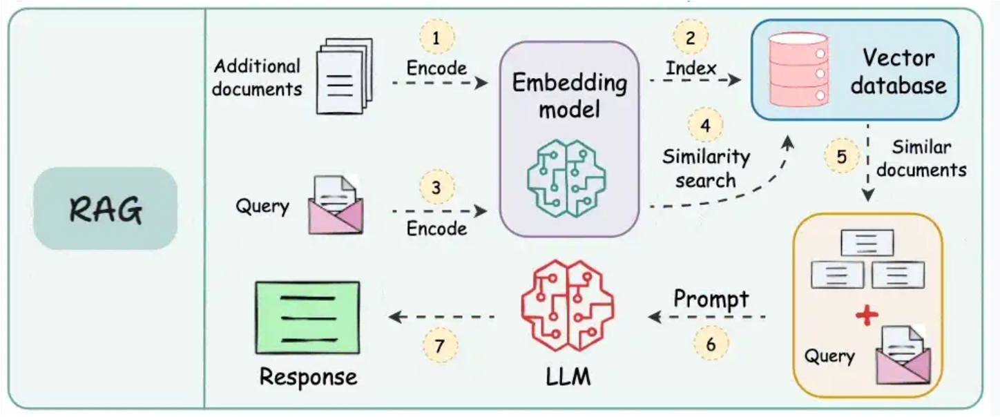

## RAG verstehen: Retrieval Augmented Generation

In der Welt der Large Language Models (LLMs) ist **RAG (Retrieval Augmented Generation)** eine leistungsstarke Technik, die entwickelt wurde, um die Fähigkeiten und die Genauigkeit generativer KI zu verbessern. Im Wesentlichen ermöglicht RAG den KI-Modellen im CompanyGPT, auf aktuelle, spezifische und oft proprietäre Informationen aus externen und internen Quellen zuzugreifen und diese zu nutzen, über ihr ursprüngliches Trainingswissen hinaus.

### Was ist RAG?

Im Kern ist RAG eine Methode, die ein Informationsabrufsystem mit einem generativen LLM kombiniert. Anstatt sich ausschließlich auf das interne Wissen des LLM zu verlassen (das veraltet sein oder domänenspezifische Details vermissen lassen kann), *ruft* RAG zunächst relevante Informationen aus einer bestimmten Wissensbasis ab und *ergänzt* dann den Prompt des LLM mit diesem abgerufenen Kontext. Das LLM nutzt diesen angereicherten Kontext dann, um eine informiertere, genauere und fundiertere Antwort zu *generieren*.

Man kann sich RAG so vorstellen, dass es dem LLM ein "offenes Buch" zur Verfügung stellt, das es vor der Beantwortung konsultieren kann, anstatt sich nur auf sein Gedächtnis zu verlassen.

### RAG als spezialisiertes Tool

Wie bereits erläutert, kann RAG als eine spezialisierte Art von "Tool" innerhalb eines umfassenderen [Tool-Use-Frameworks](./tool-use.md) betrachtet werden. Während allgemeine Tools Aktionen ausführen (wie das Senden einer E-Mail oder das Aktualisieren einer Datenbank) oder Echtzeitdaten abrufen können, besteht die primäre Funktion von RAG in der **Informationsbeschaffung für die kontextuelle Textgenerierung**. Es ist speziell darauf ausgelegt:

*   **Antworten auf Fakten zu stützen.** Um zu verhindern, dass das LLM "halluziniert" oder falsche Informationen generiert.
*   **Auf proprietäres Wissen zuzugreifen.** CompanyGPT kann Fragen auf der Grundlage Ihrer internen Dokumente, Richtlinien oder Daten beantworten.
*   **Aktuelle Informationen bereitzustellen.** Um sicherzustellen, dass die Antworten die neuesten Informationen in Ihrer Wissensbasis widerspiegeln, auch wenn diese nicht Teil der ursprünglichen Trainingsdaten des LLM waren.
*   **Kontext zu erweitern.** Dem LLM reichhaltige, relevante Details für umfassendere und hilfreichere Antworten zu liefern.

### Warum RAG mit CompanyGPT nutzen?

Die Integration von RAG-Funktionen in CompanyGPT bietet erhebliche Vorteile:

*   **Genauigkeit & Zuverlässigkeit:** Antworten werden direkt durch überprüfbare externe Daten gestützt.
*   **Domänenspezifität:** CompanyGPT kann zum Experten für die spezifischen Operationen, Produkte und internen Dokumente Ihres Unternehmens werden.
*   **Aktualität der Informationen:** Nicht mehr durch Stichtage der Trainingsdaten begrenzt, kann CompanyGPT Fragen basierend auf den neuesten internen Berichten, Besprechungsnotizen oder Richtlinienaktualisierungen beantworten.
*   **Reduzierung von Halluzinationen:** Durch die Bereitstellung expliziten Kontexts wird die Wahrscheinlichkeit, dass das LLM selbstbewusst falsche Informationen generiert, drastisch reduziert.
*   **Verbessertes Benutzererlebnis:** Benutzer erhalten relevantere, präzisere und vertrauenswürdigere Antworten.

## RAG-Workflow für die Dateiverarbeitung

Der Prozess, wie CompanyGPT RAG für die Dateiverarbeitung nutzt, z. B. beim Durchsuchen Ihrer hochgeladenen Dokumente, folgt einem klaren und effizienten Workflow. Dies ermöglicht dem System, die relevantesten Teile Ihrer internen Wissensbasis intelligent zu finden und zu nutzen.

(Quelle: [https://blog.dailydoseofds.com/p/9-rag-llm-and-ai-agent-cheat-sheets](https://blog.dailydoseofds.com/p/9-rag-llm-and-ai-agent-cheat-sheets))

Hier ist eine Aufschlüsselung des typischen RAG-Workflows bei der Dokumentenabfrage:

1.  **Dokumente hochladen und durch Einbettungsmodell kodieren:**
    Wenn Sie Dokumente (z. B. PDFs, Word-Dateien, interne Berichte) hochladen, werden diese zuerst verarbeitet. Dies beinhaltet das Aufteilen in kleinere, überschaubare Abschnitte (z. B. Absätze oder Sektionen). Jeder Abschnitt wird dann mithilfe eines spezialisierten KI-Modells (einem Einbettungsmodell) in eine numerische Darstellung, ein sogenanntes "Embedding", umgewandelt. Diese Embeddings erfassen die semantische Bedeutung des Textes.

2.  **Embeddings in Vektordatenbank indizieren:**
    Die generierten Embeddings aller Ihrer Dokumentenabschnitte werden in einer hocheffizienten Datenbank, einer sogenannten Vektordatenbank, gespeichert. Diese Datenbank ist optimiert für das Speichern und schnelle Suchen dieser numerischen Vektoren basierend auf ihrer Ähnlichkeit.

3.  **Suchanfrage mit demselben Einbettungsmodell kodieren:**
    Wenn ein Benutzer eine Anfrage an CompanyGPT sendet (z. B. "Wie lautet unsere Richtlinie zur Telearbeit?"), wird diese Anfrage ebenfalls mithilfe des *exakt gleichen* Einbettungsmodells, das für Ihre Dokumente verwendet wurde, in ein Embedding umgewandelt. Dies gewährleistet Konsistenz in der Darstellung der semantischen Bedeutung.

4.  **Ähnlichkeitssuche zwischen kodierten Daten in der Vektordatenbank durchführen:**
    Die kodierte Benutzeranfrage (ihr Embedding) wird dann mit allen gespeicherten Embeddings der Dokumentenabschnitte in der Vektordatenbank verglichen. Das System führt eine "Ähnlichkeitssuche" durch, um die Dokumentenabschnitte zu finden, deren Embeddings den Embeddings der Anfrage numerisch am nächsten kommen. Dies deutet auf eine semantische Relevanz hin.

5.  **Ähnliche Dokumente verwenden und ursprüngliche Anfrage erweitern:**
    Die relevantesten Dokumentenabschnitte (oft als "Kontext" oder "abgerufene Passagen" bezeichnet) werden dann extrahiert. Diese abgerufenen Abschnitte, die die für die Benutzerfrage relevanten Sachinformationen enthalten, werden dann mit der ursprünglichen Benutzeranfrage kombiniert.

6.  **LLM mit Dokumenten, Anfrage und Systemanweisungen prompten:**
    Schließlich wird dieser erweiterte Prompt – der die ursprüngliche Anfrage, die abgerufenen relevanten Dokumentenabschnitte und alle internen Systemanweisungen (z. B. "Antworte prägnant", "Beziehe dich auf die bereitgestellten Dokumente") enthält – an das Large Language Model innerhalb von CompanyGPT gesendet.

7.  **Antwort an den Benutzer zurückgeben:**
    Das LLM verarbeitet diesen umfassenden Prompt und greift direkt auf den bereitgestellten Dokumentenkontext zurück, um eine genaue, fundierte und hilfreiche Antwort zu formulieren, die dann an den Benutzer zurückgegeben wird.

Dieser nahtlose Prozess stellt sicher, dass CompanyGPT Antworten liefert, die nicht nur konversationsorientiert, sondern auch sachlich fundiert und direkt relevant für die einzigartige Informationslandschaft Ihres Unternehmens sind.